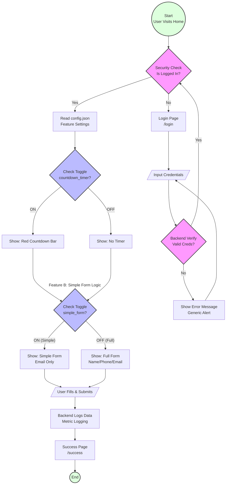

### 使用者流程圖 (User Flow)

```mermaid
flowchart TD
    Start((Start<br>User Visits Home)) --> CheckSession{Security Check<br>Is Logged In?}
    
    %% A&A Authentication Flow
    CheckSession -- No --> LoginPage[Login Page<br>/login]
    LoginPage --> InputCreds[/Input Credentials/]
    InputCreds --> VerifyCreds{Backend Verify<br>Valid Creds?}
    VerifyCreds -- No --> ShowError[Show Error Message<br>Generic Alert]
    ShowError --> InputCreds
    
    %% 驗證成功回連
    VerifyCreds -- Yes --> CheckSession
    
    %% Feature Toggling & UI Rendering
    CheckSession -- Yes --> ReadConfig[Read config.json<br>Feature Settings]
    ReadConfig --> ToggleTimer{Check Toggle<br>countdown_timer?}
    
    %% Feature A: Countdown Timer (保持垂直)
    ToggleTimer -- ON --> ShowTimer[Show: Red Countdown Bar]
    ToggleTimer -- OFF --> NoTimer[Show: No Timer]
    
    %% 將 Feature B 包在子圖表中，強制橫向排列 (Left to Right)
    subgraph FeatureB_Area [Feature B: Simple Form Logic]
        direction LR
        ToggleForm{Check Toggle<br>simple_form?}
        
        %% 讓這兩個選項左右排，而不是上下排
        ToggleForm -- ON (Simple) --> SimpleUI[Show: Simple Form<br>Email Only]
        ToggleForm -- OFF (Full) --> ComplexUI[Show: Full Form<br>Name/Phone/Email]
    end

    %% 連接 A 到 B
    ShowTimer --> ToggleForm
    NoTimer --> ToggleForm
    
    %% Interaction & End
    SimpleUI --> UserAction[/User Fills & Submits/]
    ComplexUI --> UserAction
    
    UserAction --> LogMetric[Backend Logs Data<br>Metric Logging]
    LogMetric --> SuccessPage[Success Page<br>/success]
    SuccessPage --> End((End))

    %% Styling
    style CheckSession fill:#f9f,stroke:#333,stroke-width:2px
    style VerifyCreds fill:#f9f,stroke:#333,stroke-width:2px
    style ToggleTimer fill:#bbf,stroke:#333,stroke-width:2px
    style ToggleForm fill:#bbf,stroke:#333,stroke-width:2px
    style Start fill:#dfd,stroke:#333,stroke-width:2px
    style End fill:#dfd,stroke:#333,stroke-width:2px
    
    %% 讓子圖表背景透明，看起來比較不像一個框框
    style FeatureB_Area fill:none,stroke:none
```
