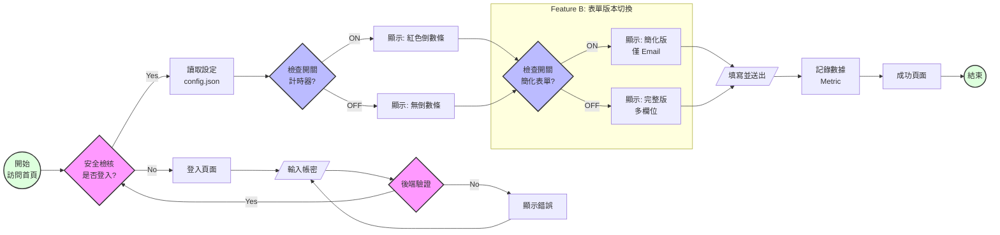

### 使用者流程圖 (User Flow)

```mermaid
flowchart LR
    %% 定義節點樣式
    classDef security fill:#f9f,stroke:#333,stroke-width:2px;
    classDef feature fill:#bbf,stroke:#333,stroke-width:2px;
    classDef startend fill:#dfd,stroke:#333,stroke-width:2px;

    %% 主流程開始
    Start((開始<br>訪問首頁)) --> CheckSession{安全檢核<br>是否登入?}
    class Start startend
    class CheckSession security

    %% 登入與驗證迴圈
    CheckSession -- No --> LoginPage[登入頁面]
    LoginPage --> InputCreds[/輸入帳密/]
    InputCreds --> VerifyCreds{後端驗證}
    class VerifyCreds security
    
    VerifyCreds -- No --> ShowError[顯示錯誤]
    ShowError --> InputCreds
    VerifyCreds -- Yes --> CheckSession

    %% 功能切換區域 (Feature Toggles)
    CheckSession -- Yes --> ReadConfig[讀取設定<br>config.json]
    ReadConfig --> ToggleTimer{檢查開關<br>計時器?}
    class ToggleTimer feature

    %% Feature A: 倒數計時器
    ToggleTimer -- ON --> ShowTimer[顯示: 紅色倒數條]
    ToggleTimer -- OFF --> NoTimer[顯示: 無倒數條]

    %% Feature B: 簡化表單 (使用子圖表讓它整齊排列)
    subgraph FormLogic [Feature B: 表單版本切換]
        direction TB
        ToggleForm{檢查開關<br>簡化表單?}
        class ToggleForm feature
        
        ToggleForm -- ON --> SimpleUI[顯示: 簡化版<br>僅 Email]
        ToggleForm -- OFF --> ComplexUI[顯示: 完整版<br>多欄位]
    end

    %% 連接 A 到 B
    ShowTimer --> ToggleForm
    NoTimer --> ToggleForm

    %% 互動與結束
    SimpleUI --> UserAction[/填寫並送出/]
    ComplexUI --> UserAction
    
    UserAction --> LogMetric[記錄數據<br>Metric]
    LogMetric --> SuccessPage[成功頁面]
    SuccessPage --> End((結束))
    class End startend
```
