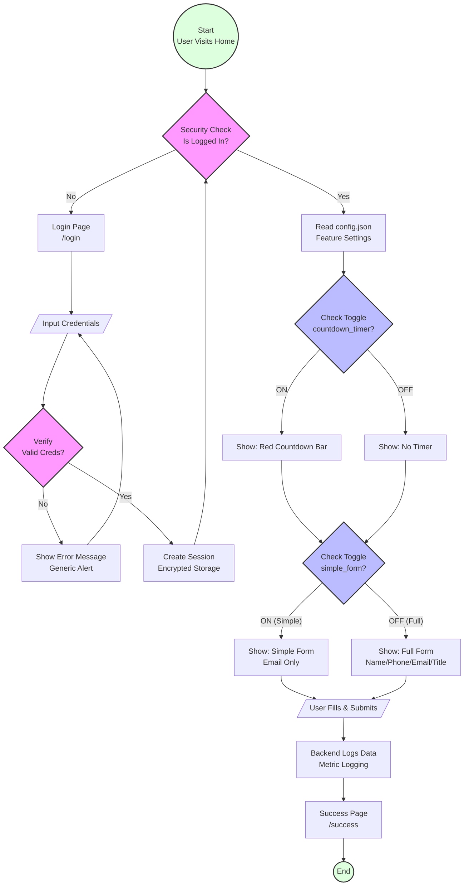

### 使用者流程圖 (User Flow)

```mermaid
flowchart TD
    Start((Start<br>User Visits Home)) --> CheckSession{Security Check<br>Is Logged In?}
    
    %% A&A Authentication Flow
    CheckSession -- No --> LoginPage[Login Page<br>/login]
    LoginPage --> InputCreds[/Input Credentials/]
    InputCreds --> VerifyCreds{Verify<br>Valid Creds?}
    VerifyCreds -- No --> ShowError[Show Error Message<br>Generic Alert]
    ShowError --> InputCreds
    VerifyCreds -- Yes --> CreateSession[Create Session<br>Encrypted Storage]
    CreateSession --> CheckSession
    
    %% Feature Toggling & UI Rendering
    CheckSession -- Yes --> ReadConfig[Read config.json<br>Feature Settings]
    ReadConfig --> ToggleTimer{Check Toggle<br>countdown_timer?}
    
    %% Feature A: Countdown Timer
    ToggleTimer -- ON --> ShowTimer[Show: Red Countdown Bar]
    ToggleTimer -- OFF --> NoTimer[Show: No Timer]
    
    ShowTimer --> ToggleForm{Check Toggle<br>simple_form?}
    NoTimer --> ToggleForm
    
    %% Feature B: Simple Form
    ToggleForm -- ON (Simple) --> SimpleUI[Show: Simple Form<br>Email Only]
    ToggleForm -- OFF (Full) --> ComplexUI[Show: Full Form<br>Name/Phone/Email/Title]
    
    %% Interaction & End
    SimpleUI --> UserAction[/User Fills & Submits/]
    ComplexUI --> UserAction
    
    UserAction --> LogMetric[Backend Logs Data<br>Metric Logging]
    LogMetric --> SuccessPage[Success Page<br>/success]
    SuccessPage --> End((End))

    %% Styling
    style CheckSession fill:#f9f,stroke:#333,stroke-width:2px
    style VerifyCreds fill:#f9f,stroke:#333,stroke-width:2px
    style ToggleTimer fill:#bbf,stroke:#333,stroke-width:2px
    style ToggleForm fill:#bbf,stroke:#333,stroke-width:2px
    style Start fill:#dfd,stroke:#333,stroke-width:2px
    style End fill:#dfd,stroke:#333,stroke-width:2px
```
