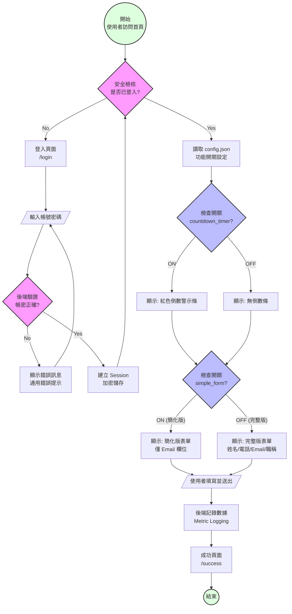

### 使用者流程圖 (User Flow)

```mermaid
flowchart TD
    Start((開始<br>使用者訪問首頁)) --> CheckSession{安全檢核<br>是否已登入?}
    
    %% A&A 身分驗證流程
    CheckSession -- No --> LoginPage[登入頁面<br>/login]
    LoginPage --> InputCreds[/輸入帳號密碼/]
    InputCreds --> VerifyCreds{後端驗證<br>帳密正確?}
    VerifyCreds -- No --> ShowError[顯示錯誤訊息<br>通用錯誤提示]
    ShowError --> InputCreds
    VerifyCreds -- Yes --> CreateSession[建立 Session<br>加密儲存]
    CreateSession --> CheckSession
    
    %% 功能切換與介面呈現
    CheckSession -- Yes --> ReadConfig[讀取 config.json<br>功能開關設定]
    ReadConfig --> ToggleTimer{檢查開關<br>countdown_timer?}
    
    %% Feature A: 倒數計時器
    ToggleTimer -- ON --> ShowTimer[顯示: 紅色倒數警示條]
    ToggleTimer -- OFF --> NoTimer[顯示: 無倒數條]
    
    ShowTimer --> ToggleForm{檢查開關<br>simple_form?}
    NoTimer --> ToggleForm
    
    %% Feature B: 簡化表單
    ToggleForm -- ON (簡化版) --> SimpleUI[顯示: 簡化版表單<br>僅 Email 欄位]
    ToggleForm -- OFF (完整版) --> ComplexUI[顯示: 完整版表單<br>姓名/電話/Email/職稱]
    
    %% 互動與結束
    SimpleUI --> UserAction[/使用者填寫並送出/]
    ComplexUI --> UserAction
    
    UserAction --> LogMetric[後端記錄數據<br>Metric Logging]
    LogMetric --> SuccessPage[成功頁面<br>/success]
    SuccessPage --> End((結束))

    %% 樣式設定
    style CheckSession fill:#f9f,stroke:#333,stroke-width:2px
    style VerifyCreds fill:#f9f,stroke:#333,stroke-width:2px
    style ToggleTimer fill:#bbf,stroke:#333,stroke-width:2px
    style ToggleForm fill:#bbf,stroke:#333,stroke-width:2px
    style Start fill:#dfd,stroke:#333,stroke-width:2px
    style End fill:#dfd,stroke:#333,stroke-width:2px
```
