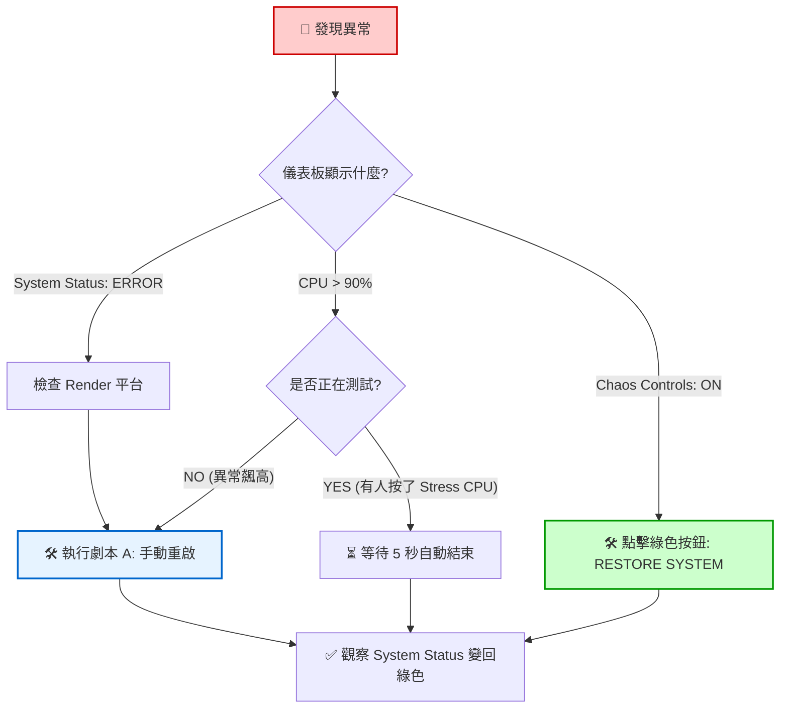

```mermaid
graph TD
    Start[🚨 發現異常] --> CheckUI{儀表板顯示什麼?}
    
    %% 分支 1: 服務死掉
    CheckUI -- "System Status: ERROR" --> CheckRender[檢查 Render 平台]
    CheckRender --> Restart[🛠️ 執行劇本 A: 手動重啟]
    
    %% 分支 2: CPU 飆高
    CheckUI -- "CPU > 90%" --> CheckChaos{是否正在測試?}
    CheckChaos -- YES (有人按了 Stress CPU) --> Wait[⏳ 等待 5 秒自動結束]
    CheckChaos -- NO (異常飆高) --> Restart
    
    %% 分支 3: 混沌模式忘記關
    CheckUI -- "Chaos Controls: ON" --> Restore[🛠️ 點擊綠色按鈕: RESTORE SYSTEM]
    
    %% 匯聚
    Restart --> Verify[✅ 觀察 System Status 變回綠色]
    Wait --> Verify
    Restore --> Verify
    
    style Start fill:#ffcccc,stroke:#cc0000,stroke-width:2px
    style Restart fill:#e6f3ff,stroke:#0066cc,stroke-width:2px
    style Restore fill:#ccffcc,stroke:#009900,stroke-width:2px
   
```
