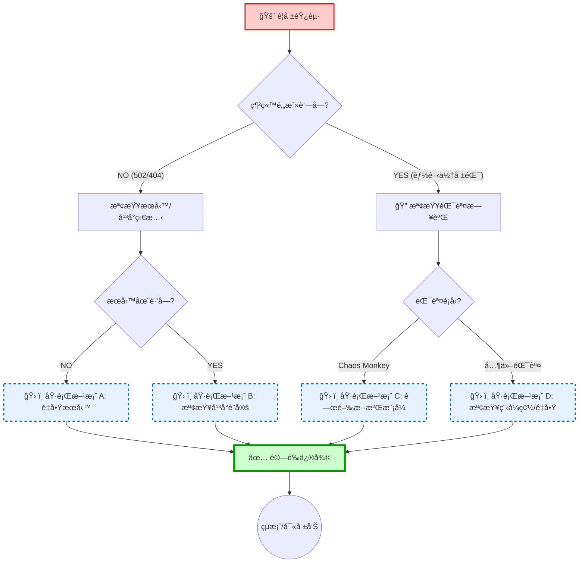

```mermaid
graph TD
    Start[🚨 警報響起] --> Check{網站還活著�}

    %% 分支 1: æœå‹™æ­»æ‰ (502/404)
    %% 修改：ä¸å†æª¢æŸ¥ Docker 容器，改為檢查æœå‹™ç‹€æ…‹ (例如 Render)
    Check -- NO (502/404) --> CheckStatus[檢查æœå‹™/å¹³å°ç‹€æ…‹]
    CheckStatus --> IsRunning{æœå‹™åœ¨è·‘å—?}
    IsRunning -- NO --> Restart[ğŸ› ï¸ åŸ·è¡Œæ–¹æ¡ˆ A: é‡å•Ÿæœå‹™]
    IsRunning -- YES --> CheckConfig[ğŸ› ï¸ åŸ·è¡Œæ–¹æ¡ˆ B: 檢查平å°è¨­å®š]

    %% 分支 2: æœå‹™æ´»è‘—但報錯
    %% 修改：移除 DB Error，ä¿ç•™ Chaos Monkey 和一般錯誤
    Check -- YES (能開但報錯) --> CheckLogs[🔠檢查錯誤日誌]
    CheckLogs --> ErrorType{錯誤é¡å‹?}
    ErrorType -- "Chaos Monkey" --> StopChaos[ğŸ› ï¸ åŸ·è¡Œæ–¹æ¡ˆ C: 關閉混沌模å¼]
    ErrorType -- "其他錯誤" --> CheckCode[ğŸ› ï¸ åŸ·è¡Œæ–¹æ¡ˆ D: 檢查程å¼ç¢¼/é‡å•Ÿ]

    %% 匯èšèˆ‡é©—è­‰
    Restart --> Verify[✅ 驗證修復]
    CheckConfig --> Verify
    StopChaos --> Verify
    CheckCode --> Verify

    Verify --> End((çµæ¡ˆ/寫報告))

    %% 樣å¼è¨­è¨ˆ (ä¿æŒä¸€è‡´)
    style Start fill:#ffcccc,stroke:#cc0000,stroke-width:2px
    style Restart fill:#e6f3ff,stroke:#0066cc,stroke-width:2px,stroke-dasharray: 5 5
    style StopChaos fill:#e6f3ff,stroke:#0066cc,stroke-width:2px,stroke-dasharray: 5 5
    style CheckCode fill:#e6f3ff,stroke:#0066cc,stroke-width:2px,stroke-dasharray: 5 5
    style CheckConfig fill:#e6f3ff,stroke:#0066cc,stroke-width:2px,stroke-dasharray: 5 5
    style Verify fill:#ccffcc,stroke:#009900,stroke-width:4px
```
